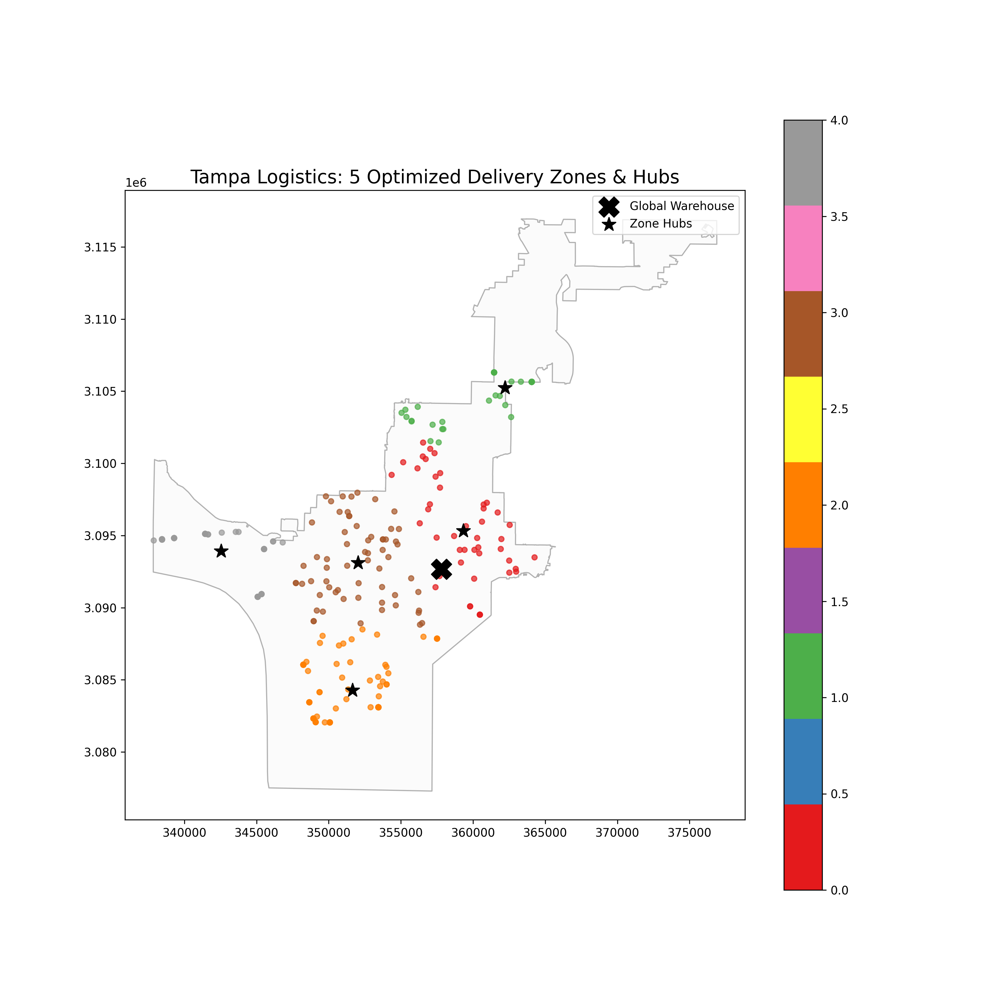

# 🚚 Logistics Network Optimization & Delivery Efficiency

## 📌 Project Overview
This project develops a `GIS-based logistics optimization system to improve last-mile delivery efficiency using spatial analysis and automation.

---

## 🎯 Problem Statement
A logistics company operating in Tampa, Florida dispatches 5 drivers daily from a central warehouse to fulfill approximately 300 customer deliveries. Current routing methods are inefficient, resulting in increased delivery times and fuel costs.

This project aims to optimize delivery operations using clustering and network-based routing.

---

## 📍 Study Area
Tampa, Florida, USA

---

## 🧱 System Components
- Warehouse (single origin point)
- Delivery locations (300 customer points)
- Road network (OpenStreetMap)

---

## 🔄 Workflow

### ETL (Extract, Transform, Load)
1. Infrastructure Ingestion: Extracted high-fidelity road network data for Tampa, FL using OSMnx, ensuring the inclusion of drivable street segments.

2. Spatial Point Generation: Implemented a robust while loop logic to generate 300 synthetic delivery coordinates strictly within the Tampa municipal boundary.

3. Spatial Snapping & Integrity: Performed nearest-neighbor analysis to "snap" random coordinates to the closest road network nodes, ensuring 100% routing connectivity and eliminating "off-road" data points.

4. Coordinate System Alignment: Reprojected all spatial layers to UTM Zone 17N (EPSG:32617) to enable mathematically accurate distance measurements in meters.

### Spatial Analysis
1. Territory Partitioning: Leveraged the K-Means Clustering algorithm to divide the 300 delivery points into 5 optimized zones, minimizing the total spatial variance for each driver's daily workload.

2. Hub Discovery: Calculated mathematical centroids for each zone to identify optimized "local hubs" or staging areas for dispatch.

3. Infrastructure Validation: Created visual overlays of road networks, delivery points, and warehouse origins to verify spatial alignment.

### Automation
1. Input new delivery data
2. Automatically re-run clustering and routing
3. Output updated routes and maps

---

## 📊 Success Metrics
- Total route distance
- Total delivery time
- Average deliveries per driver
- Percentage improvement after optimization

---

## 🛠️ Tools & Technologies
- Python (GeoPandas, OSMnx, NetworkX)
- PostGIS
- QGIS

---

## 🖼️ Analysis Results

*Delivery Zones & Infrastructure Validation*

The map below illustrates the 300 delivery points (colored by driver zone), the central Warehouse origin (X), and the calculated Hub centroids (*) for each territory.

---
## 📁 Project Structure
logistics-optimization/
│── data/
        │──raw
        │──processed
│── notebooks/
│── src/
│── reports/
        │──figures
│── outputs/
│── README.md

---

## 🚀 Status
[x] Phase 1: Project setup and planning

[x] Phase 2: ETL & Spatial Alignment (Snapping/Projection)

[x] Phase 3: Cluster Analysis (K-Means)

[ ] Phase 4: Route Optimization & Traveling Salesman Problem (TSP)

[ ] Phase 5: Performance Metrics & Reporting