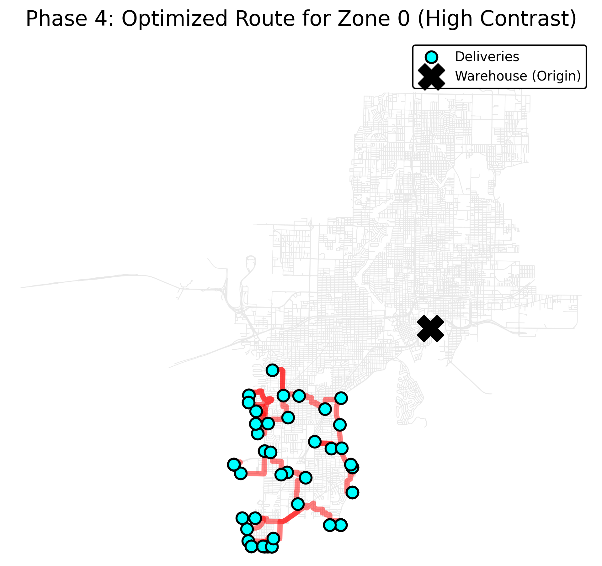

# 🚚 Logistics Network Optimization & Delivery Efficiency

## 📌 Project Overview
This project develops a GIS-based logistics optimization system to improve last-mile delivery efficiency in Tampa, Florida. By leveraging spatial clustering and network graph theory, the system automates the partitioning of service areas and calculates optimized driving routes for a fleet of five delivery vehicles.

---

## 🎯 Problem Statement
A logistics company operating in Tampa dispatches 5 drivers daily to fulfill approximately 300 customer deliveries. Traditional routing methods often lead to overlapping territories and inefficient driving paths.

This project solves these inefficiencies by:

Clustering points to minimize travel between stops.

Optimizing the specific sequence of visits using the Traveling Salesman Problem (TSP) logic.

---

## 📍 Study Area
Tampa, Florida, USA

---

## 🧱 System Components
- Warehouse (single origin point)
- Delivery locations (300 customer points)
- Road network (OpenStreetMap)

---

## 🔄 Workflow

### ETL (Extract, Transform, Load)
1. Infrastructure Ingestion: Extracted high-fidelity road network data for Tampa, FL using OSMnx, ensuring the inclusion of drivable street segments.

2. Spatial Point Generation: Implemented a robust while loop logic to generate 300 synthetic delivery coordinates strictly within the Tampa municipal boundary.

3. Spatial Snapping & Integrity: Performed nearest-neighbor analysis to "snap" random coordinates to the closest road network nodes, ensuring 100% routing connectivity.

4. Coordinate System Alignment: Reprojected all spatial layers to UTM Zone 17N (EPSG:32617) to enable mathematically accurate distance measurements in meters.

### Spatial Analysis
1. Territory Partitioning: Leveraged the K-Means Clustering algorithm to divide the 300 delivery points into 5 optimized zones, minimizing the total spatial variance for each driver's daily workload.

2. Hub Discovery: Calculated mathematical centroids for each zone to identify optimized "local hubs" or staging areas for dispatch.

3. Infrastructure Validation: Created visual overlays of road networks, delivery points, and warehouse origins to verify spatial alignment.

### Automation
1. Input new delivery data
2. Automatically re-run clustering and routing
3. Output updated routes and maps

---

## 📊 Success Metrics
After executing the full optimization pipeline, the system achieved the following results for a single daily dispatch:

| Metric                     | Value                                   |
|--------------------------|-----------------------------------------|
| Total Deliveries         | 300                                     |
| Active Fleet             | 5 Drivers                               |
| Total Fleet Mileage      | 259.21 miles                            |
| Average Miles per Driver | ~51.8 miles                             |
| Estimated Daily Fuel Cost| $129.61 (at $5.00/gal, 10 MPG)          |

---

## 🛠️ Tools & Technologies
Language: Python

Spatial Libraries: GeoPandas, OSMnx, Pyproj

Graph Theory: NetworkX

Machine Learning: Scikit-Learn (K-Means)

Visualization: Matplotlib

---

## 🖼️ Analysis Results

*Delivery Zones & Infrastructure Validation*

The map below illustrates the 300 delivery points (colored by driver zone), the central Warehouse origin (X), and the calculated Hub centroids (*) for each territory.

Optimized Routing (Zone 0 Example)
Detailed street-level routing for a single driver territory, showing the optimized path connecting all delivery nodes back to the warehouse

---
## 📁 Project Structure
logistics-optimization/
│── data/
│   ├── raw/           # Original boundary and generated points
│   └── processed/     # Snapped points, road graphs, and clustered data
│── notebooks/         # Development and analysis scratchpads
│── reports/
│   └── figures/       # Exported high-contrast maps and charts
│── README.md

---

## 🚀 Status
[x] Phase 1: Project setup and planning

[x] Phase 2: ETL & Spatial Alignment (Snapping/Projection)

[x] Phase 3: Cluster Analysis (K-Means)

[x] Phase 4: Route Optimization & TSP Implementation

[x] Phase 5: Performance Metrics & Final Reporting